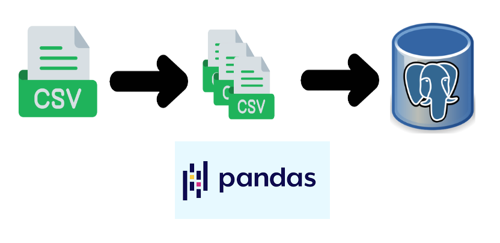

# **Project 2: Crowdfunding ETL**
 

 
 
  

# **Contributors**   
- Gabriel Adriano
- Rajendra Bondili
- Michael Zabala
- Jun Leng Tan

# **Description**  
Used Pandas to extract data from a large CSV file, transform the data into distinct CSV files, and finally load the CSVs into tables in Postgres database.  
**Files included**  
- ETL_Mini_Project_Group3_GAdriano_RBondili_MZabala_JLTan.ipynb
- crowdfunding_db_schema.sql
- crowdfunding_ERD.png
- SELECT_statement.png (screenshot to show the CSVs were imported successfully and SELCT statements (joining all the tables) work fine.
- Resouces\  
  - campaign.csv
  - contacts.csv
  - category.csv
  - subcategory.csv
